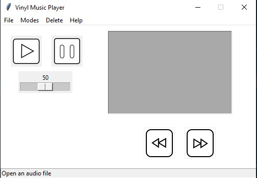

# Vinyl Music Player
This is a simple music player made with Python and Tkinter, code is simple and easy to understand.

NOTE - This application is intended to be used either for personal use or for educational purposes, use in any any other field is at your own risk even though the Licence allows
usage for such purposes.

# Usage -

## Steps to use - 
  

1 - Download and unzip the repository.

2 - Open your terminal or command prompt and execute the following commands.

`pip install pygame`

`pip install tinytag`

`pip install pillow`

3 - Run `Vinyl.py`.

4 - After the music player screen appears it should look something like this...

5 - On the Music Player window click `File` and then click `Open`.

6 - A file-dialog should come up, choose a MP3 or WAV file
(I have not tested other file formats).

7 - The song name should come up on the listbox, click the play button.

8 - Done!!! Your song should be playing now.

# Features

1 - Light and dark mode - Click modes and choose Light or Dark

2 - Shows picture of artist - If a file called `cover.jpg` is available in the same folder as your song it will display that image after opening the song, intended to display a picture of the artist who made the songs in the folder. If `cover.jpg` is not available then it will display this...

3 - Volume slider - Allows you to change the volume of the song being played. (Note that the volume changed in the app is relative to system volume, so if system volume is 50% and app volume is 100% the volume of the sound being played is 100% of 50)

# Coming in version 1.1

| Current   | New |
| ----- | --- |
| Dark mode does not affect all elements| Dark mode affects all  elements |
|No previous song or next song functionality| Go to previous song or next song|

# Build to executable
Steps to convert to executable-
1- Open Cmd and type `pip install cx_freeze`

2- cd to the downloaded folder and run `python build.py build`

3- Copy the images, namely `Vinyl.jpg` `player.jpg` `PauseButton.png` `PlayButton.png` and put it in build\exe.win-amd64-3.9

4- Run Vinyl.exe

# Communicate with me
Use [Discussions ](https://github.com/Sharan-Python/vinyl-music-player/discussions) to talk about this repo
# Credits 
icons for the buttons- Provided by Ipython08

Volume slider- provided by Ipython08

New Vinyl Music Player icon- provided by Ipython08
