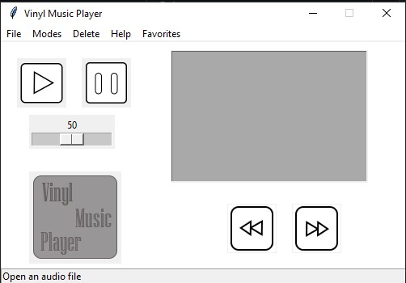

# Vinyl Music Player
This is a simple music player made with Python and Tkinter, code is simple and easy to understand.

Play your favorite songs with ease

# Usage -

## Steps to use - 
  

1 - Download and unzip the repository.

2 - Open your terminal or command prompt and execute the following commands.

`pip install pygame`

`pip install tinytag`

`pip install pillow`

3 - Run `Vinyl.py`.

4 - After the music player screen appears it should look something like this...

5 - On the Music Player window click `File` and then click `Open a song` or `Open a folder`(When opening a folder make sure that the first song is a mp3 file)

6 - A file-dialog should come up, choose a `.mp3`, `.mx`, `.mod` or a `.wav` file or a folder

7 - The song name should come up on the listbox, click the play button.

8 - Done!!! Your song should be playing now.

# Features

1 - Light and dark mode - Click modes and choose Light or Dark

2 - Shows picture of artist - If a file called `cover.jpg` is available in the same folder as your song it will display that image after opening the song, intended to display a picture of the artist who made the songs in the folder. If `cover.jpg` is not available then it will display this... 

3 - Volume slider - Allows you to change the volume of the song being played. (Note that the volume changed in the app is relative to system volume, so if system volume is 50% and app volume is 100% the volume of the sound being played is 100% of 50)

4- Next button and Previous button- Open a bunch of songs and click the play button now use the next button to go to the next song and vise versa

5- Delete song functionlity- use the delete cascade to delete one selected song or to delete all songs

6- Opens the folder you opened last time- If you ran the player and opened a folder, it will open the same folder on next startup automatically
# Installer
The file `Vinyl Music Player x64 Installer.exe` is a distributable installer for the app. Can be used just like a regular app installer. Note that this installer will only be updated when major changes are made, minor changes to the player will not result in an update to the installer

7- Favorite folder option - Under the Favorites sub-menu you can add a favorite folder and then click it anytime to open that folder you chose
# Build to executable
Steps to convert to executable-
1- Open Cmd and type `pip install cx_freeze`

2- cd to the downloaded folder and run `python build.py build` for microsoft store python installations and `py build.py build` for installations downloaded from python.org

3- Copy the images, namely `Vinyl.jpg` `player.jpg` `PauseButton.png` `PlayButton.png` and put it in build\exe.win-amd64-3.9

4- Run Vinyl.exe

# Communicate with me
Use [Discussions ](https://github.com/Sharan-Python/vinyl-music-player/discussions) to talk about this repo
# Credits 
icons for the buttons- Provided by Ipython08

New Vinyl Music Player icon- provided by Ipython08

Volume slider, some other stuff and bug fixes :)- provided by Ipython08

# Go to [this link](https://github.com/Sharan-Python/vinyl-music-player/wiki) 
To see the current status on the project and upcoming versions

# Important info
NOTE - This application is intended to be used either for personal use or for educational purposes, use in any any other field is at your own risk even though the Licence allows
usage for such purposes.

NOTE - This application has been tested with successful results with the Windows operating system, it has been test with unsuccessful results on Mac OS and has not been tested on Linux, hence I only expect the application to run on Windows and not any other OS

NOTE - Any executable file in this repository may be blocked by your OS or by your browser or some other security software, these files if downloaded and blocked may cause them to go corrupt and not work properly, to get around this, I recommend that you download the whole repository at once and then use the executable files. I also give confirmation that no file in this repository is capable of doing harm or good to you/your computer software/your computer hardware.

# Profile views -

INVITE YOUR FRIENDS TO VIEW MY PROFILE AND REPOSITORIES OR I WILL TAKE YOUR DOG
